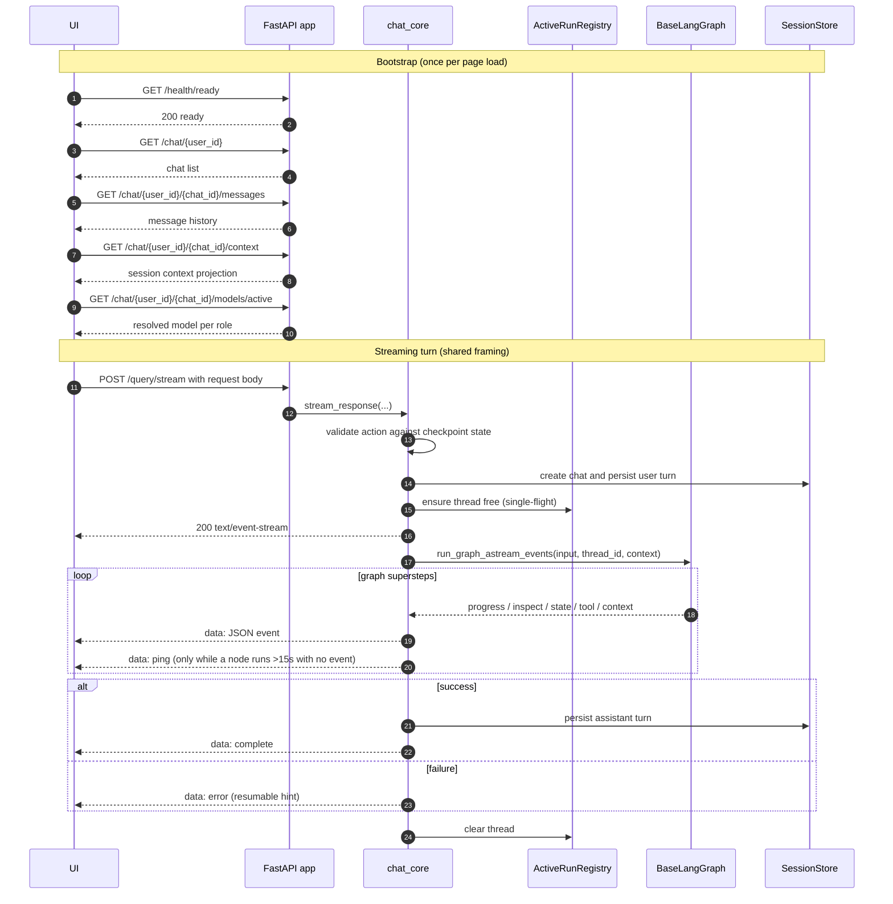
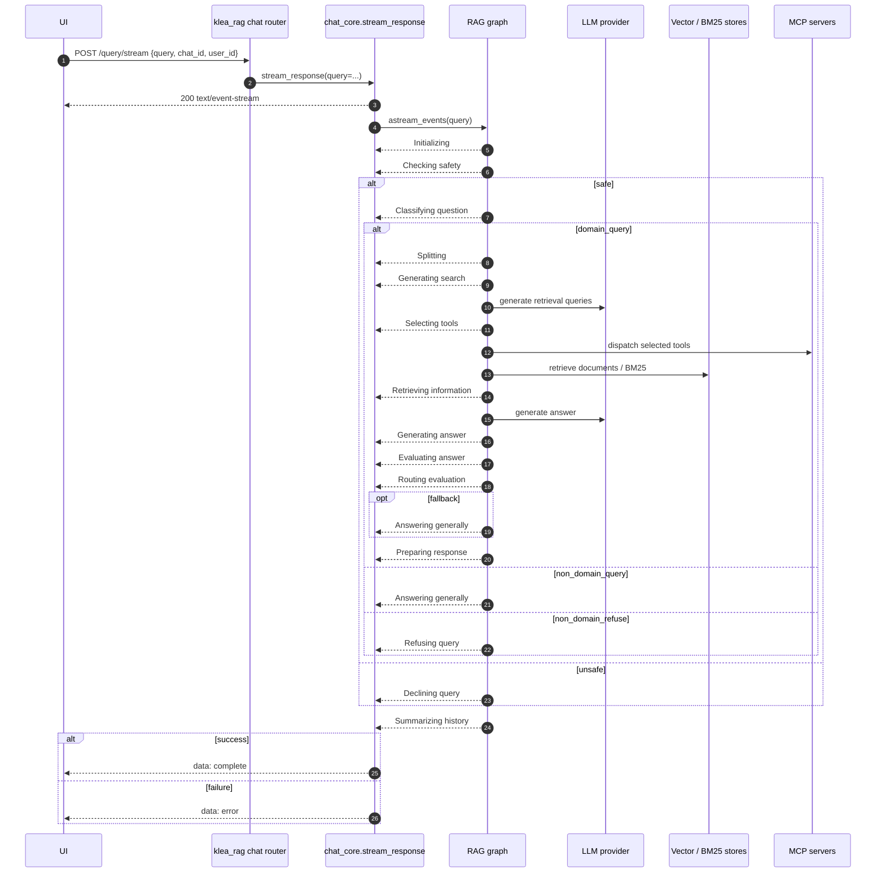
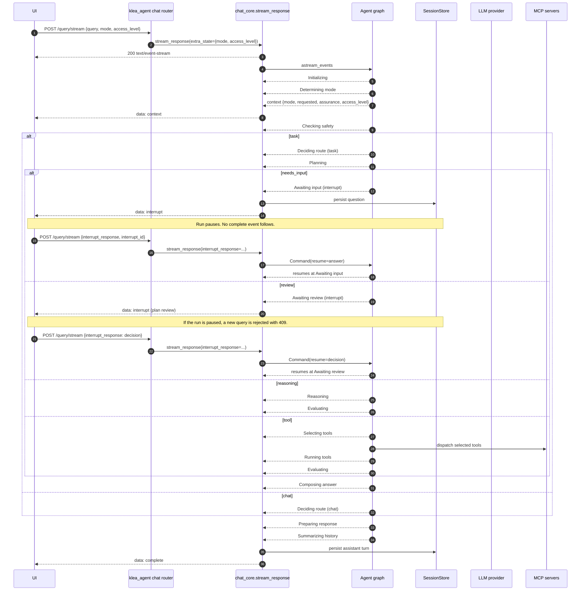

# API / SSE interaction sequences: RAG and agent chat flows

Status: architecture documentation.  Reflects the monorepo at the time of
writing.  This is the C4 *dynamic* view (runtime interaction) that pairs with
the static C4 views in the sibling files.  The chat request lifecycle is shown
per app because the two apps share the transport but differ in their contract
and lifecycle: RAG is a fire-and-answer pipeline, while the agent adds
human-in-the-loop interrupts, failure resume, and a session-context
projection.

See also: `streams.md` (the event catalogue this view sequences),
`c4-container.md` (Level 2), `c4-component-rag.md` and
`c4-component-agent.md` (Level 3 static views).

## Scope

The diagrams show the ordered HTTP and Server-Sent Events (SSE) exchange
between a client UI and a Klea FastAPI app, plus the app-side components each
step reaches.  Mermaid `sequenceDiagram` is used (the C4 dynamic notation in
docs-as-code form; renders on GitHub).  These are documentation of the
*intended* flow, not telemetry: for live wire traffic use the browser Network
panel or distributed tracing.

Every app is assembled by `make_app` (`klea_utils/api/app.py`) from the shared
routers (`health`, `sessions`, `messages`, `context`, `models`, `credentials`)
plus the app's own chat router (`klea_utils/api/chat_core.py` plumbing).  The
app port differs (`klea_rag` :8005, `klea_agent` :8006) but the paths below are
identical across apps.

## Shared framing (both apps)

The bootstrap reads are identical for RAG and the agent; the streaming path
shares the framing in `chat_core.stream_response` (single-flight per thread,
SSE framing, error frames) and `BaseLangGraph.run_graph_astream_events`
(emission).  What differs is the request body and the event/lifecycle branches,
shown per app below.

Notes:

* The user turn is persisted when the run starts; the assistant turn on
  `complete` (or the interrupt question on pause), so a failed run stays
  visible and retryable.
* `POST /query/cancel` is a separate, idempotent request (always 204) that
  reaches the registered asyncio task via `ActiveRunRegistry.cancel`; the
  graph leaves a resumable checkpoint.
* `chat_core.stream_response` injects a periodic `ping` frame whenever no graph
  event arrives for `HEARTBEAT_INTERVAL_SECONDS` (15 s), so a long-running node
  (e.g. `run_command`) does not let the client's idle read timeout (300 s) or a
  proxy drop the SSE stream.  Clients ignore `ping`; see `streams.md`.

## RAG lifecycle (`klea_rag`)

RAG's `ChatPayload` is `{query, chat_id, user_id}` only.  It has no
`resume` / `interrupt_response` / `interrupt_cancel` fields and no
`context_snapshot` override, so no `context` event is produced.  The one
terminal is `complete`; failures surface as `error`.  Graph node labels match
`rag_pkg/example-configs/rag-lang-graph.mmd`.

Notes:

* No `interrupt` event is ever emitted; the loop branches are the RAG
  evaluator's routing, not pauses.
* `POST /query/cancel` is the only way to stop a run mid-flight.

## Agent lifecycle (`klea_agent`)

The agent's `ChatPayload` adds `resume`, `interrupt_response`, `interrupt_id`,
`interrupt_cancel`, `mode`, and `access_level`.  It overrides
`context_snapshot` (`klea_agent.py`), so the graph emits a `context` event
carrying mode, requested mode, assurance, note, and effective access level
(ADR-0032).  It has HITL nodes (`Awaiting review`, `Awaiting input`) whose
pause is delivered as an `interrupt` event (ADR-0046).  Graph node labels match
`agent_pkg/example-configs/klea-agent-lang-graph.mmd`.

Notes:

* **Answering an interrupt**: the follow-up `POST /query/stream` carries
  `interrupt_response` (and `interrupt_id`); `chat_core` validates it against
  the thread's paused state and resumes with `Command(resume=...)`.  A plain
  query while paused is rejected with 409.
* **Cancelling an interrupt**: `interrupt_cancel: true` resumes with
  `{"action": "cancel"}` and routes to `Cancelled`, a terminal run.
* **Resuming a failed run**: `resume: true` re-invokes the graph with `None`
  input so the failed node re-runs from its checkpoint (no user turn written).
* **Stopping an active run**: `POST /query/cancel` (idempotent, 204) cancels
  the asyncio task; the checkpoint stays resumable.

## Per-app deltas

| Aspect | `klea_rag` | `klea_agent` |
|--------|------------|--------------|
| Chat payload | `query`, `chat_id`, `user_id` | adds `resume`, `interrupt_response`, `interrupt_id`, `interrupt_cancel`, `mode`, `access_level` |
| Initial state extras | none | `mode.requested`, optional `access_level` |
| `context` event | none (base `context_snapshot` returns `None`) | emits mode / assurance / note / access_level |
| HITL `interrupt` / resume | none | `Awaiting input`, `Awaiting review` |
| Failed-run resume | n/a | `resume: true` |
| Cancel | `POST /query/cancel` | `POST /query/cancel` |
| Shared plumbing | `chat_core.stream_response`, `sse.py`, `runs.py`, `make_app` | same |
| Graph export | `rag_pkg/example-configs/rag-lang-graph.mmd` | `agent_pkg/example-configs/klea-agent-lang-graph.mmd` |

## Pointers

* Transport and framing: `klea_utils/api/sse.py` (client),
  `klea_utils/api/chat_core.py` (server runners),
  `klea_utils/api/chat_common.py` (thread identity, cancel),
  `klea_utils/api/runs.py` (`ActiveRunRegistry`).
* HITL: `klea_utils/api/hitl.py`; ADR-0046.
* Event catalogue: `streams.md`; ADR-0040 (amends ADR-0013).
* App contracts: `rag_pkg/klea_rag/api/chat.py`,
  `agent_pkg/klea_agent/api/chat.py` (ADR-0031).
* Session context: `agent_pkg/klea_agent/klea_agent.py` `context_snapshot`;
  ADR-0032.
* Routers: `klea_utils/api/{health,sessions,messages,context,models,credentials}.py`.
