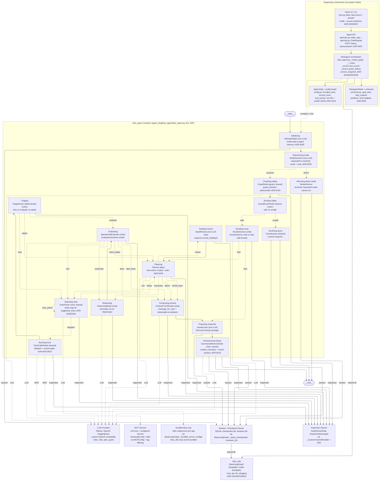
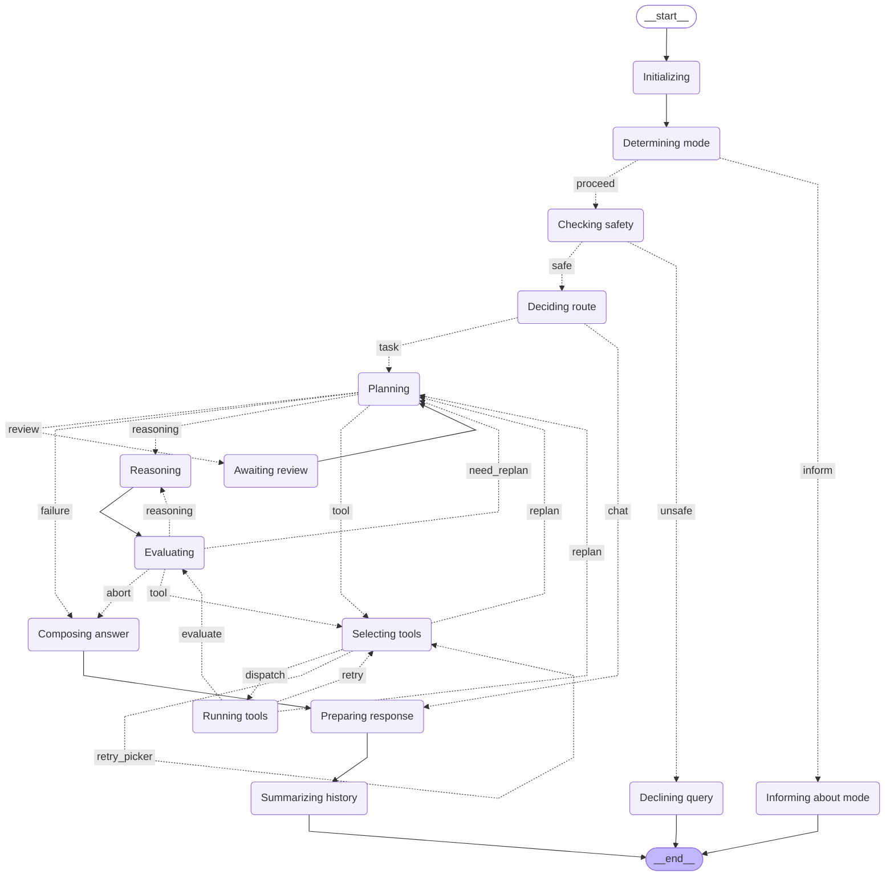

# C4 model: Level 3 -- Component diagram (Agent)

Status: architecture documentation. Reflects the agent container at the
time of writing. This is the Level 3 view for the ``klea_agent`` container
(``agent_pkg``); the Level 1 system context is in `c4-system-context.md`
and the Level 2 container diagram is in `c4-container.md`.  The RAG
container's sibling view is `c4-component-rag.md`.

## Scope and intent

A component diagram zooms into one container and shows its *components*
-- the major code units that make up the container -- plus how they
interact with each other and with the containers / external systems from
Level 2.  Per the C4 standard (https://c4model.com/diagrams/component)
components are deployable as part of their container.

**Container in scope:** ``klea_agent`` (the general-purpose research
agent: ``agent_pkg/klea_agent``).  The diagram shows the agent's LangGraph
nodes (the general operational path, ADR-0035) plus the supporting
components that own the graph (the ``KleaAgent`` orchestrator and its
routers/callbacks), load configuration, define the state, and expose the
API and UI.  It also shows the MCP, LLM, session/checkpoint and inspection
interactions that the graph calls.  The graph is implemented over
``klea_utils.graph.base.BaseLangGraph`` (ADR-0016 Template Method) and the
nodes share ``klea_utils/nodes/abstract.py`` (ADR-0019) and the ADR-0013 /
ADR-0040 inspection stream.

Level 3 for the agent is rendered as a Mermaid ``flowchart`` with
``layout: elk`` (orthogonal routing) for the same reason as Levels 2 and
3-RAG.  The node/edge topology is sourced from the code (``klea_agent.py:
422`` ``_create_graph``; ``klea_agent.py:699`` ``_export_graph_png`` also
writes the ``.mmd`` via ``graph.get_graph().draw_mermaid()``) and then
augmented with the component-to-container/external edges that
``draw_mermaid`` does not see.

## Component diagram -- Agent container (flowchart, elk + auto-generated core)

The auto-generated LangGraph topology (faithful to code) is embedded as
the core.  The explicit diagram adds the supporting components, the
deterministic router components (which have no generated box because they
are attached via ``add_conditional_edges`` rather than ``add_node``), and
the LLM, MCP, session and inspection edges that ``draw_mermaid`` does not
see.  Keep the node names in sync with ``klea-agent-lang-graph.mmd``
(``agent_pkg/example-configs/klea-agent-lang-graph.mmd``) -- that file is
the ``klea_agent.py:699`` artefact generated alongside
``klea-agent-lang-graph.png``.

*Notes:* Solid `-->` = normal graph edge (from ``klea_agent.py:422``).
Dotted `-. label .->` = conditional ``add_conditional_edges``
(``GuardRouter``, ``RouteDecision``, ``Planner``, the picker router, the
``TriageRouter``, the evaluator router).  Double-dash `inspection` /
`session` / `MCP` / `LLM` edges are component-to-container/external
interactions that ``draw_mermaid`` omits; they are what make this a C4
Level 3 rather than a bare node graph.  The deterministic routers
(``Routing safety``, ``Triaging``) and the ``needs_input`` planner edge are
augmentations: in the generated topology the routers are conditional-edge
functions attached to ``Checking safety`` and ``Running tools``, so they
have no box, and ``failure`` and ``needs_input`` both collapse to the
``Composing answer`` edge.  The supporting components are shown as a
separate block because C4 components are inside the container, but they
are not graph nodes.  The auto-generated
``agent_pkg/example-configs/klea-agent-lang-graph.mmd`` (``config:
flowchart: curve: linear`` plus ``classDef first/last``) is the faithful
``draw_mermaid()`` artefact kept alongside the PNG; the node labels above
are normalised to it (``Summarizing history`` not ``Summarizing_history``).

## Auto-generated LangGraph topology (faithful to code, for drift check)

This is the verbatim ``draw_mermaid()`` output from ``klea_agent.py:699``
(``agent_pkg/example-configs/klea-agent-lang-graph.mmd``, also writes
``.mmd`` alongside ``.png`` via ``BaseLangGraph._export_graph_png``). Keep
the explicit diagram above in sync with it; do not edit this block by
hand.

## Components

| Component | File | Role | Key contracts |
|-----------|------|------|---------------|
| KleaAgent orchestrator | ``klea_agent/klea_agent.py`` | ``BaseLangGraph`` subclass: ``_create_graph``, the conditional-edge routers, the tool-round/picker callbacks, ``context_snapshot`` | ``env_prefix``/config discovery (ADR-0015); graph exported as ``klea-agent-lang-graph.{png,mmd}`` (ADR-0016/0032/0035) |
| AppConfig / config loader | ``klea_agent/config.py`` | JSON app config + env file/profile resolution | ``general.bundled_tools``, ``general.access_level``, ``general.tool_access``, ``mcp_servers``, ``providers`` (ADR-0015/0037) |
| KleaAgentState + schemas | ``klea_agent/schemas.py`` | Graph state and structured outputs | ``goal``, ``plan``, ``step_outputs``, ``artefacts``, retry budgets, ``mode``, ``route``, ``evaluation`` (ADR-0032/0035) |
| Agent API | ``klea_agent/api/{main,chat,server}.py`` | FastAPI app via ``make_app`` + the agent ``ChatPayload`` chat router | ``POST /query``, ``/query/stream``; ``mode``/``access_level`` in the payload; generic routers from ``klea_utils.api`` (ADR-0031) |
| Client UI / CLI | ``klea_agent/ui/cli.py`` + ``ui/web/*`` | Typer CLI (``klea``, ``klea-serve``) and NiceGUI pages over shared components | mode selector, tool-access selector, status pane (ADR-0030/0031/0037) |
| Initializing | ``klea_agent/nodes/init_graph.py`` | ``InitGraphState``: seeds/resets plan-scoped state each turn | Non-LLM; resets ``goal``/``plan``/``step_outputs``/counters (ADR-0035) |
| Determining mode / Informing | ``klea_agent/nodes/mode_router.py`` | ``ModeDecision`` resolves requested -> resolved; ``ModeInformer`` is terminal | Non-LLM; ``mode.note`` routes to inform instead of downgrading (ADR-0030) |
| Checking safety | ``klea_utils/nodes/guard.py`` | ``GuardNode`` (``guard`` role, shared) | ``guard_decision`` ``safe``/``unsafe`` (ADR-0010) |
| Routing safety | ``klea_utils/nodes/guard_router.py`` | ``GuardRouterNode`` (shared router) | reads ``guard_decision`` -> ``safe``/``unsafe`` edge |
| Declining query | ``klea_utils/nodes/fixed_answer.py`` | ``FixedAnswer``: canned refusal | terminal; writes ``message_for_user`` |
| Deciding route | ``klea_agent/nodes/route_decision.py`` | ``RouteDecision`` (``chat``): narrow entry router, fail-closed | ``RouteSchema`` ``chat`` (inline answer) / ``task``; no tool list (ADR-0035) |
| Planning | ``klea_agent/nodes/planner.py`` | ``Planner`` (``plan``): sole author of the goal + plan | ``PlannerOutput``/``PlannerPlanSchema``; structural validation + validation-retry; ``unplannable`` fail-closed (ADR-0035) |
| Awaiting review | ``klea_agent/nodes/await_review.py`` | ``AwaitReview``: captures human review input only | Non-LLM stub (``STUB_REVIEW``) until the HITL interrupt/resume ADR; writes ``human_feedback`` |
| Selecting tools | ``klea_utils/nodes/tools_picker.py`` | ``ToolsPicker`` (shared, ``chat``): binds arguments for the step's ``suggested_tools`` | per-app prompt registry, full static ``tools_info``; ``on_unusable`` callback; never substitutes a tool (ADR-0020/0034) |
| Running tools | ``klea_utils/nodes/tools_caller.py`` | ``ToolsCallerNode`` (shared): dispatches the batch | ``dispatch_tool_calls`` (parallel), ``checkpaths``/access gate, ``isError`` synthesis; ``post_dispatch`` callback (ADR-0003/0007/0037) |
| Triaging | ``klea_agent/nodes/triage_router.py`` | ``TriageRouter`` (deterministic router): mechanical tool-error triage | ``retry`` (re-pick same tool) / ``evaluate`` / ``replan``; ADaPT counter via ``update_tool_retry_counts`` (ADR-0035) |
| Reasoning | ``klea_agent/nodes/reasoning.py`` | ``ReasoningNode`` (``chat``): produces a step conclusion | ``ReasoningSchema``; records a ``str`` ``StepOutput`` + ``rationale``; no picker/caller (ADR-0035) |
| Evaluating | ``klea_agent/nodes/operational_evaluator.py`` | ``OperationalEvaluator`` (``chat``): judges the current step | ``EvaluationSchema`` verdict ``step_incomplete``/``step_done``/``plan_done``/``need_replan``/``abort`` (ADR-0035) |
| Composing answer | ``klea_agent/nodes/answer_from_results.py`` | ``AnswerFromResults`` (``chat``): synthesises the reply | ``message_for_user``; success persists the deliverable to ``artefacts``; never judges (ADR-0035) |
| Preparing response | ``klea_agent/nodes/answer_user.py`` | ``AnswerUser``: delivers the final user-facing message | Non-LLM |
| Summarizing history | ``klea_utils/nodes/summarise_memory.py`` | ``SummariseMemoryNode`` (``chat``, shared) | ``context_summary`` + recent window; preserves state on a blank summary (ADR-0018) |
| LLM Providers | external | chat, plan and guard inference | provider/model resolution via ``klea_utils.llm`` including catalog ``provider:<model>``; per-request model switching (ADR-0014) |
| MCP servers (``nml-mcp`` + configured) | ``mcp_pkg`` + operator config | domain tools over streamable-http/stdio | ``MCPConfig`` + tag filtering; reached only by ``Running tools`` |
| bundled ``klea-mcp`` | ``klea_utils.mcp.server.bundled`` | shared file/web tools, stdio subprocess per app | ``BaseLangGraph._bundled_server_config()`` (ADR-0004) |
| Session / Checkpoint | ``klea_utils/api/sessions_db.py`` + ``graph/base.py`` | ``AsyncSqliteSaver`` | ``checkpoints.db``, ``sessions.db`` (ADR-0023) |
| Inspection stream | ``klea_utils`` node stream + SSE | per-node ``inspect``/``state``/``usage`` events | ``NodeStreamData`` via ``_CustomChannelEnabler`` (ADR-0013/0040) |

## How the components interact (mirrors Level 2)

* The agent is the WIP path (``c4-system-context.md:36``, ``klea_agent
  WIP``); its control flow is documented in
  `agent-general-path-control-flow.md` and its topology decision in
  ADR-0035 (which supersedes the ADR-0025 proposal).
* Every agent component that needs an LLM (guard, route, plan, picker,
  reasoning, evaluate, compose, summarise) is a ``BaseLLMNode``
  (``klea_utils/nodes/base.py``, ADR-0019) and goes through the shared
  retryer + token-window ladder (ADR-0017), the structured-output
  fallback (``devdocs/system/structured-output-fallback.md``), and the
  ``BaseLangGraph`` per-request model switching (ADR-0014).
* ``ToolsPicker``/``ToolsCallerNode`` are shared with RAG (ADR-0020); the
  agent adds the plan-aware picker contract (bind only the step's
  ``suggested_tools``; ``on_unusable`` -> synthetic error + ``replan_reason``)
  and the ADaPT retry counter.
* ``KleaAgent`` is the composition point for the whole container: it
  creates the nodes, wires the conditional edges (the routers are methods
  or ``AbstractRouterNode`` classes), keeps the per-round/picker callbacks
  (``_record_tool_round``, ``_record_picker_failure``), and projects the
  session context onto the stream (ADR-0032).
* Diagrams live in ``devdocs/system/`` as the single source of truth
  (``devdocs/README.md:21``); ``docs/developer-info.rst`` links to them on
  GitHub.

## Open items (Level 3+)

* The scientific-mode correctness layer (ADR-0029/0036) is not yet
  implemented: it inserts grounding, evidence, provenance and an
  independent verifier additively on this general path, and adds the
  scientific answer variant.  This diagram shows the general path only.
* The HITL interrupt/resume stage (``AwaitReview`` -> real LangGraph
  ``interrupt``/``Command(resume=...)`` and wiring ``needs_input`` to
  resume the same run) will change the review and ``needs_input`` edges.
* Parallel step execution (ADR-0041, draft) and dependency-frontier
  batching will change the step-entry structure.
* The retrieval tool (``search_stores``) that wires RAG stores into the
  agent is deferred per the control-flow note; when added it is a new
  ``Running tools`` target (an MCP/tool component, not a graph node).
* The ``nml-mcp`` tool/sandbox layout and the ``klea_utils`` API/stores
  internals are future code-level views.
