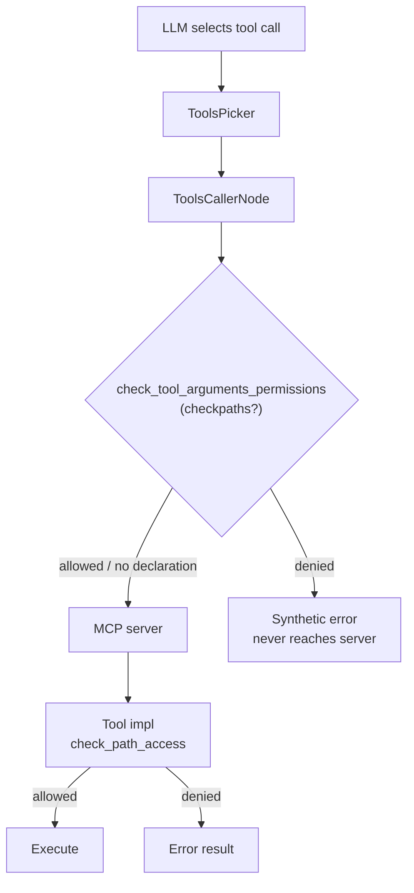

# MCP tool permissions: current state, limits, and options

Status: design note.  In-tool path checks, the client-side per-path gate
and the annotation-driven tool access level are implemented; the
allow/deny/ask ruleset and interactive approval loop are deferred.
Updates to this note should be reflected in the permission layer as it
evolves.

Last updated: 2026-09-14 (invocation axis / tool access level implemented,
ADR-0037; path layers decision at ADR-0007).

## Current state

`klea_utils.mcp.tool_impls.permission` provides `check_path_access(path,
project_root=None)` and `PermissionDeniedError`.  It is an author-side
defense layer:

- `path` is allowed only when it resolves inside `project_root` (default:
  the current working directory).  Both sides are fully resolved first, so
  `..` traversal and symlink escapes outside the boundary are caught.
- Every Klea-authored tool that reads or writes the filesystem must gate
  its path arguments through `check_path_access` and return a clear,
  non-halting error on denial:
  - `list_files` (`klea_utils/mcp/tool_impls/list_files.py`) -- takes
    `project_root`.
  - `download_file` (`klea_utils/mcp/tool_impls/download_file.py`) -- takes
    `project_root`.
  - `download_file_to_cache` scopes its boundary to its own cache
    directory, so per-app cache helpers keep working unmodified.

`check_tool_arguments_permissions(tool_meta, arguments, project_root)`
(`klea_utils/mcp/tool_impls/permission.py`) is the client-side counterpart: it
reads the `checkpaths` key from a tool's MCP `meta` dict and checks each
declared path argument without raising.  It never touches a server it does
not control, so the gate is:

- **Author-side (in-tool):** the checks above, run inside the tool
  implementation.
- **Client-side (pre-dispatch):** `klea_utils.mcp.dispatch.dispatch_tool_calls`
  runs `check_tool_arguments_permissions` on every call before it reaches
  the MCP server.  Denied calls never reach the server; they become a
  synthetic, non-halting error result so the LLM can adapt.  The gate runs
  in the shared `ToolsCallerNode` (`klea_utils/nodes/tools_caller.py`) used
  by both Klea Agent and Klea RAG.

Both agents/RAG are expected to run from the directory the user is working
in, so the client-side gate uses `project_root=None` (the current working
directory) by default -- the same boundary the in-tool checks default to,
so the two layers agree.



## Declaring which arguments are paths

Tool authors mark path arguments declaratively on `ToolInfo`:

```python
@tool_meta(ToolInfo(..., checkpaths=["path"]))
async def list_files(path: str, ...): ...
```

`register_tools` folds `checkpaths` into the tool's `meta` dict, which
travels to clients on the MCP Tool's `_meta` field.  Tools that read or
write the filesystem should also call `check_path_access` inside their
implementation (the author-side layer).  Self-contained helpers with their
own containment (e.g. `download_file_to_cache`, the sandboxed code
execution tools) are not marked: their boundary is their own cache/sandbox,
not the project root.

## The invocation axis: tool access levels

Permission has two axes (ADR-0007): *may this tool be invoked?* and *may
it touch path X?*.  The `checkpaths` declaration above handles the second;
the first is the **tool access level** (ADR-0037).

`klea_utils.mcp.access` provides
`AccessLevel = Literal["read_only", "full"]`, the default `full`, and the
helpers `tool_permits` / `filter_tools_info` / `check_tool_access`.  The
level is carried on the shared `BaseGraphSchema.access_level` (ADR-0032);
the agent defaults to `full`, RAG is fixed at `read_only` (it retrieves
and must never mutate).

A tool is classified from its MCP `ToolAnnotations` (`readOnlyHint` /
`destructiveHint`, ADR-0004), which `BaseLangGraph._build_tools_info`
copies onto `ToolInfo`.  In `read_only`, a tool is permitted only when it
is explicitly `read_only` and not `destructive`; a tool with no
annotation fails closed.  Enforcement mirrors the path gate:

- **Disclosure:** the Planner and `ToolsPicker` filter `tools_info` by the
  level, so disallowed tools are never shown to the model.
- **Dispatch:** `dispatch_tool_calls` rejects a disallowed call with the
  same synthetic `is_error` result used for a `checkpaths` denial, before
  it reaches the server.

A deployment can override a tool's classification through the per-tool
`general.tool_access` map (`ToolAccessOverride`: `read_only` /
`destructive`), for tools whose server does not annotate.  Precedence is
`tool_access` override > annotation > fail-closed; the map is applied when
`ToolInfo` is built, so disclosure and dispatch agree.

Annotations are self-reported hints (`mcp.types.ToolAnnotations`): they are
authoritative for Klea-authored/trusted servers and advisory for
third-party ones.  The access level is a least-privilege rail, **not** a
boundary against a malicious server; only OS sandboxing (layer 3 below) is.
See `../adr/0037-tool-access-levels.md` for the trust model and the
deferred roadmap (consent loop, sandbox-by-default, curated servers,
credential scoping).

## Standardised tool call state

Both Klea Agent and Klea RAG use the shared `ToolCallSchema` /
`ToolCallsSchema` from `klea_utils.mcp.schemas` and the same state fields:

- `tool_calls: list[ToolCallSchema]` -- selected calls (written by the
  shared `ToolsPicker`, `klea_utils/nodes/tools_picker.py`).
- `tool_results: list[CallToolResult]` -- results (written by the shared
  `ToolsCallerNode`).

The shared picker/caller nodes are configured per app (prompt directory,
`model_type`); the agent additionally passes a `post_dispatch` callback to
mark its per-plan-step status.

## Network safety (SSRF) for outbound tools

Outbound HTTP tools (`web_fetch`, `download_file`) share an SSRF guard in
`klea_utils.mcp.tool_impls.ssrf` (`check_ssrf`, `is_private_or_reserved`):
requests to loopback, private, link-local, reserved, or multicast
addresses are refused unless the caller passes `allow_internal_hosts=True`.

Known best-effort limitation (accepted for now): the guard checks only the
*initial* URL.  An httpx client that follows redirects
(`follow_redirects=True`) could still be redirected onto an internal host
after the check.  If this ever needs hardening, follow redirects manually
and re-check each hop.

## The author-side limit

The in-tool check only protects tools we write.  A third-party MCP server
runs its own code with its own privileges; Klea cannot inspect or bound
the paths it touches.  For servers we do not author there is no way to
enforce path-level permissions from inside the tool.

## What opencode does (external MCP tools)

Reference: the opencode repository
(https://github.com/anomalyco/opencode, checked out around 2026-08).

opencode does *not* inspect tool arguments.  Instead it applies a
client-side, per-tool-call permission policy that works for any server:

- Every external MCP tool is wrapped so its execution first runs a
  permission request keyed on the tool name (`server_tool`), see
  `packages/opencode/src/session/tools.ts` (around the
  `ctx.ask({ permission: key, ... })` call).
- The ruleset matches permission rules (allow / deny / ask) against the
  tool name, with wildcards (`tool-server_*`).  The default action when no
  rule matches is `ask`: an interactive user prompt with "once" and
  "always" replies.  "always" is remembered as an allow-rule for the
  session.  See `packages/opencode/src/permission/index.ts`.
- MCP tools denied by config are hidden from the model entirely
  (visibility filtering), so the system prompt only advertises allowed
  tools.

Key consequence: opencode's gate is *"may this tool be invoked at all"*,
never *"may it touch path X"*.  The user's approval is only as informed as
the tool description and their own understanding of the server.  A user
who approves a filesystem tool has granted it access to whatever paths the
server process can reach, and "always" turns one careless approval into a
session-wide pass.  The prompt is a consent mechanism, not a path
confinement guarantee.

## Implemented layers for Klea

This document is a system-level contract, not an ADR.  The trust model is
as built:

1. **Author-side: in-tool path checks** -- path-aware and stricter than
   opencode's name-based gate, implemented for tools Klea authors.
   Every filesystem tool gates its path arguments through
   `check_path_access` (see Current state and Declaring which arguments
   are paths).  Kept as the author-side layer.

2. **Client-side: pre-dispatch tool-call gate** -- evaluated at the call
   site before dispatching to the MCP server.  The *per-path* half is
   implemented: the shared `ToolsCallerNode` gates calls through
   `dispatch_tool_calls` + `check_tool_arguments_permissions` using each
   tool's `checkpaths` declaration, denying out-of-boundary paths before
   they reach the server.  The *allow / deny / ask* ruleset and the
   interactive user-approval loop (graph pause + TUI/web input, opencode
   style) are **deferred** -- see the TODO in `permission.py` and the
   kanban board.  The *invocation* half (tool access level) is implemented
   (ADR-0037): `dispatch_tool_calls` rejects calls to tools disallowed by
   the state's `read_only | full` level, derived from the MCP annotations.
   The client-side gate only applies to tools that declare `checkpaths`
   (path half) or annotations (invocation half); third-party servers that
   declare neither are not gated.

3. **OS-level sandboxing (orthogonal)** -- run third-party MCP servers
   (or the whole agent) in a container / bubblewrap / chroot with only
   the project directory mounted.  This is the only hard boundary for
   servers Klea does not author, and it is orthogonal to layers 1 and 2.

Implemented posture: layers 1 + 2 together, trust model as documented
above, and advise sandboxing for third-party servers.  In all cases,
connecting to a server means trusting its author: never connect to a
server you do not trust.

See also ``../adr/0007-mcp-permissions.md`` (path layers) and
``../adr/0037-tool-access-levels.md`` (invocation axis / access level) for
the architectural decisions that adopt this posture.
