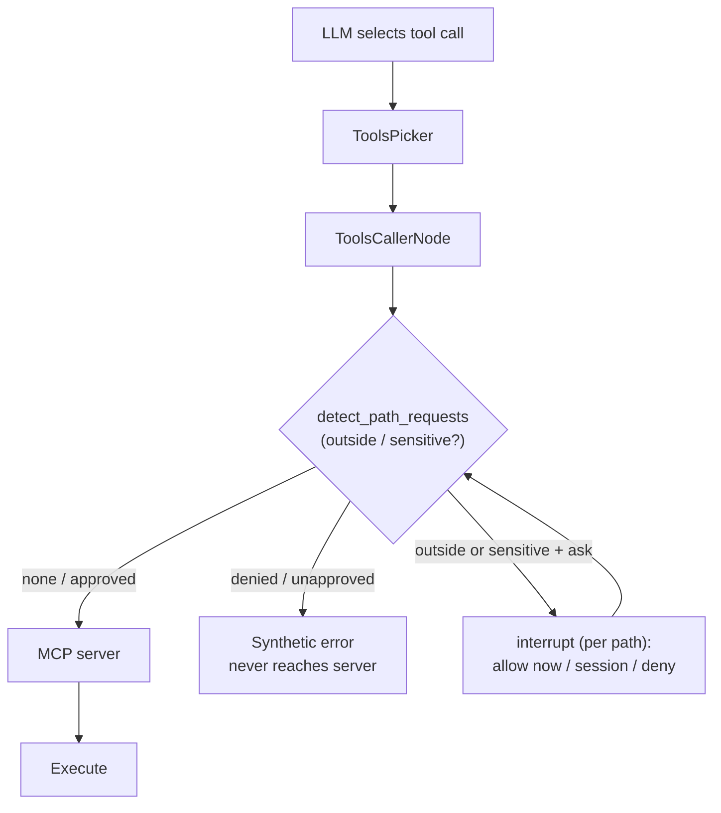

# MCP tool permissions: current state, limits, and options

Status: design note.  The client-side per-path gate, the interactive
allow-now / allow-session / deny approval loop (including the sensitive-file
second round), and the annotation-driven tool access level are implemented
(ADR-0007 update 2026-10-08).  Updates to this note should be reflected in
the permission layer as it evolves.

Last updated: 2026-10-08 (layered path discovery, interactive approval, and
the sensitive-file second round implemented; invocation axis / tool access
level at ADR-0037; path layers decision at ADR-0007).

See also `file-tools.md` for the file-tool text/binary/encoding contract and
the `read_file` paging contract, which sit on top of this boundary.

## Current state

`klea_utils.mcp.tool_impls.permission` provides the boundary helpers
(`permitted_roots`, `resolve_path`, `path_is_allowed`, and
`check_path_access`).  **The tool implementations no longer check the
boundary themselves** (ADR-0007 update 2026-10-08): `check_path_access` and
`checkpaths` are Klea conventions, not MCP, so per-tool copies added no
portable guarantee and had to be kept in sync with the client gate.  The
helpers are used by the client-side gate; `download_file_to_cache` and the
sandboxed tools remain self-contained with their own boundary.

The single enforcement point is the pre-dispatch gate in
`klea_utils.mcp.dispatch.dispatch_tool_calls`, built on
`klea_utils.mcp.path_detect.detect_path_requests` (see below) and an optional
`permission_resolver`:

- **Client-side (pre-dispatch):** every call's paths are detected before it
  reaches the MCP server.  With a `permission_resolver` the run pauses for
  the user's per-path *allow now* / *allow for session* / *deny* decision
  (ADR-0007 update 2026-10-08) via the shared HITL interrupt (ADR-0046); a
  request left unapproved blocks the call -- it never reaches the server and
  becomes a synthetic, non-halting error result so the LLM can adapt.  With
  no resolver, every outside path is denied (the pre-ADR-0007 behaviour).
  The gate runs in the shared `ToolsCallerNode`
  (`klea_utils/nodes/tools_caller.py`) used by both Klea Agent and Klea RAG;
  the agent opts into `permission_policy="ask"`, RAG keeps `"deny"`.  A
  resolved ask is also emitted as an `inspect` entry (heading "Path
  permission": the requested keys and the allow/deny resolution) so the
  inspection pane keeps an audit of the decision after the chat form is
  gone.

Both agents/RAG are expected to run from the directory the user is working
in, so the client-side gate uses `project_root=None` (the current working
directory) by default.

### Layered path discovery

`klea_utils.mcp.path_detect.detect_path_requests` is the client-side
discovery function the gate uses to decide which paths a call would touch.
It unions, per call, three confidence tiers:

- `declared` -- the tool's declared `checkpaths` argument values;
- `expected` -- paths the tools picker declared for the call;
- `guess` -- heuristic: path-ish argument names, plus path-like values
  (shell command strings are split with `shlex.split` first, and non-`file`
  URLs, flags, operators and pure globs are skipped; `file:` URIs are
  unwrapped to their path).

Only paths that resolve outside `project_root` plus any session-approved
`allowed_dirs` become requests; they are de-duplicated by resolved directory,
keeping the strongest tier, and sorted.  Each request carries its tier and
source so the approval prompt can show a guess differently from a declared
path.  Discovery is advisory (a tool can ignore its arguments and touch any
path at runtime); OS sandboxing remains the only hard boundary.

### Sensitive files (second round)

Paths that resolve *inside* a permitted root are normally allowed.  When the
agent asks (a resolver is present), a second round flags credential-bearing
files via `klea_utils.mcp.sensitive.is_sensitive` -- env files, private keys,
cloud config, and the `KLEA_SENSITIVE_PATTERNS` extras.  These become
`sensitive` requests, approved per *file* (persisted in
`BaseGraphSchema.allowed_files`), unlike `outside` requests (per directory).
It is best-effort: a renamed secret, a secret inline in source, or a
directory scan can slip past a filename matcher, and approval is consent, not
redaction of what reaches the model.


```mermaid
flowchart TD
    LLM[LLM selects tool call] --> Picker[ToolsPicker]
    Picker --> Caller[ToolsCallerNode]
    Caller --> PreCheck{"detect_path_requests\n(outside / sensitive?)"}
    PreCheck -- none / approved --> Server[MCP server]
    PreCheck -- denied / unapproved --> Synth1[Synthetic error\nnever reaches server]
    PreCheck -- "outside or sensitive + ask" --> Approval["interrupt (per path):\nallow now / session / deny"]
    Approval --> PreCheck
    Server --> Exec[Execute]
```

## Declaring which arguments are paths

Tool authors mark path arguments declaratively on `ToolInfo`:

```python
@tool_meta(ToolInfo(..., checkpaths=["path"]))
async def list_files(path: str, ...): ...
```

`register_tools` folds `checkpaths` into the tool's `meta` dict, which
travels to clients on the MCP Tool's `_meta` field.  The client-side gate
reads it; the tool implementation no longer checks the boundary itself
(ADR-0007 update 2026-10-08).  `checkpaths` is the deterministic discovery
tier; the gate also covers tools that declare none (heuristics).  Tools with
their own containment (e.g. `download_file_to_cache`, the sandboxed code
execution tools) are not marked: their boundary is their own cache/sandbox,
not the project root.

## The invocation axis: tool access levels

Permission has two axes (ADR-0007): *may this tool be invoked?* and *may
it touch path X?*.  The `checkpaths` declaration above handles the second;
the first is the **tool access level** (ADR-0037).

`klea_utils.mcp.access` provides
`AccessLevel = Literal["read_only", "full"]`, the default `full`, and the
helpers `tool_permits` / `filter_tools_info` / `check_tool_access`.  The
level is carried on the shared `BaseGraphSchema.access_level` (ADR-0032);
the agent defaults to `full`, RAG is fixed at `read_only` (it retrieves
and must never mutate).

A tool is classified from its MCP `ToolAnnotations` (`readOnlyHint` /
`destructiveHint`, ADR-0004), which `BaseLangGraph._build_tools_info`
copies onto `ToolInfo`.  In `read_only`, a tool is permitted only when it
is explicitly `read_only` and not `destructive`; a tool with no
annotation fails closed.  Enforcement mirrors the path gate:

- **Disclosure:** the Planner and `ToolsPicker` filter `tools_info` by the
  level, so disallowed tools are never shown to the model.
- **Dispatch:** `dispatch_tool_calls` rejects a disallowed call with the
  same synthetic `is_error` result used for a `checkpaths` denial, before
  it reaches the server.

A deployment can override a tool's classification through the per-tool
`general.tool_access` map (`ToolAccessOverride`: `read_only` /
`destructive`), for tools whose server does not annotate.  Precedence is
`tool_access` override > annotation > fail-closed; the map is applied when
`ToolInfo` is built, so disclosure and dispatch agree.

Annotations are self-reported hints (`mcp.types.ToolAnnotations`): they are
authoritative for Klea-authored/trusted servers and advisory for
third-party ones.  The access level is a least-privilege rail, **not** a
boundary against a malicious server; only OS sandboxing (layer 3 below) is.
See `../adr/0037-tool-access-levels.md` for the trust model and the
deferred roadmap (consent loop, sandbox-by-default, curated servers,
credential scoping).

Command execution (`run_command`, ADR-0038) is a special case.  It is
`destructive`/`open_world`, so it is full-mode only, and its optional
`working_directory` argument is checked like any other path -- but that check
is **advisory** here: a shell command can ignore its working directory and
touch any path, process, or host the server can reach.  OS sandboxing
(layer 3) is the only boundary for command execution; the path argument is a
convenience, not confinement.

## Root guard and call limits

Two cross-cutting guards protect Klea-authored tools (ADR-0038):

- **Root guard.**  `klea_utils.mcp.registry.register_tools` wraps every
  Klea-authored tool (bundled and NeuroML servers) so it refuses to execute
  when the server process has root privileges (effective uid 0), returning a
  non-halting error.  The override is the process environment variable
  `KLEA_ALLOW_ROOT_TOOLS` (truthy: `1`/`true`/`yes`/`on`).  `register_tools`
  and `BaseLangGraph.setup()` log a startup warning when running as root.
  Third-party MCP servers do not use `register_tools` and are not covered;
  their privileges are the operator's choice.
- **Per-call timeout backstop.**
  `klea_utils.mcp.dispatch.dispatch_tool_calls` passes a wall-clock timeout to
  `call_tool`, so a hung tool returns a non-halting time-out error instead of
  stalling the graph.  Default 900 s, overridable via the process environment
  variable `KLEA_TOOL_CALL_TIMEOUT` (`0` disables).  Individual tools should
  still enforce their own, tighter timeouts; `run_command` has its own ceiling
  in `KLEA_RUN_COMMAND_MAX_TIMEOUT`.

Both are process environment variables (like `KLEA_LOG_LEVEL`), so they must
be exported to the app/server process; env-file-only values do not propagate
to spawned MCP server subprocesses.

## Standardised tool call state

Both Klea Agent and Klea RAG use the shared `ToolCallSchema` /
`ToolCallsSchema` from `klea_utils.mcp.schemas` and the same state fields:

- `tool_calls: list[ToolCallSchema]` -- selected calls (written by the
  shared `ToolsPicker`, `klea_utils/nodes/tools_picker.py`).
- `tool_results: list[CallToolResult]` -- results (written by the shared
  `ToolsCallerNode`).

The shared picker/caller nodes are configured per app (prompt directory,
`model_role`); the agent additionally passes a `post_dispatch` callback to
mark its per-plan-step status.

## Network safety (SSRF) for outbound tools

Outbound HTTP tools (`web_fetch`, `download_file`) share an SSRF guard in
`klea_utils.mcp.tool_impls.ssrf` (`check_ssrf`, `is_private_or_reserved`):
requests to loopback, private, link-local, reserved, or multicast
addresses are refused unless the caller passes `allow_internal_hosts=True`.

`web_search` is not an SSRF surface: it POSTs to a fixed set of provider hosts
(Tavily/Exa/Parallel/Firecrawl hosted MCP, or the Brave/Serper REST APIs) and
returns result URLs as data without dereferencing them, so fetching a result
remains `web_fetch`'s job (with its SSRF guard).  See ADR-0048.

Known best-effort limitation (accepted for now): the guard checks only the
*initial* URL.  An httpx client that follows redirects
(`follow_redirects=True`) could still be redirected onto an internal host
after the check.  If this ever needs hardening, follow redirects manually
and re-check each hop.

## The author-side limit

The in-tool check only protects tools we write.  A third-party MCP server
runs its own code with its own privileges; Klea cannot inspect or bound
the paths it touches.  For servers we do not author there is no way to
enforce path-level permissions from inside the tool.

## What opencode does (external MCP tools)

Reference: the opencode repository
(https://github.com/anomalyco/opencode, checked out around 2026-08).

opencode does *not* inspect tool arguments.  Instead it applies a
client-side, per-tool-call permission policy that works for any server:

- Every external MCP tool is wrapped so its execution first runs a
  permission request keyed on the tool name (`server_tool`), see
  `packages/opencode/src/session/tools.ts` (around the
  `ctx.ask({ permission: key, ... })` call).
- The ruleset matches permission rules (allow / deny / ask) against the
  tool name, with wildcards (`tool-server_*`).  The default action when no
  rule matches is `ask`: an interactive user prompt with "once" and
  "always" replies.  "always" is remembered as an allow-rule for the
  session.  See `packages/opencode/src/permission/index.ts`.
- MCP tools denied by config are hidden from the model entirely
  (visibility filtering), so the system prompt only advertises allowed
  tools.

Key consequence: opencode's gate is *"may this tool be invoked at all"*,
never *"may it touch path X"*.  The user's approval is only as informed as
the tool description and their own understanding of the server.  A user
who approves a filesystem tool has granted it access to whatever paths the
server process can reach, and "always" turns one careless approval into a
session-wide pass.  The prompt is a consent mechanism, not a path
confinement guarantee.

## Implemented layers for Klea

This document is a system-level contract, not an ADR.  The trust model is
as built:

1. **Client-side: pre-dispatch tool-call gate** -- evaluated at the call
   site before dispatching to the MCP server, the single path enforcement
   point.  The shared `ToolsCallerNode` gates calls through
   `dispatch_tool_calls` + `detect_path_requests` (declared `checkpaths`,
   picker-declared paths, and heuristics), denying out-of-boundary paths
   before they reach the server.  With a `permission_resolver` it pauses for
   the interactive per-path *allow now* / *allow for session* / *deny* loop
   (ADR-0007 update 2026-10-08).  The *invocation* half (tool access level)
   is implemented (ADR-0037): `dispatch_tool_calls` rejects calls to tools
   disallowed by the state's `read_only | full` level, derived from the MCP
   annotations.  The path gate covers any tool Klea invokes, even those that
   declare no `checkpaths` (via heuristics); the invocation gate needs
   annotations, so a third-party server that declares none is not
   invocation-gated.

   The author-side in-tool checks (formerly layer 1) were **removed**
   (ADR-0007 update 2026-10-08): they were a Klea-only, non-portable
   duplicate of this gate.  A direct caller of a bundled server (the
   standalone `klea-mcp` CLI used by a non-Klea client) therefore has no
   path gate; there is no MCP standard that enforces path access.

2. **OS-level sandboxing (orthogonal)** -- run third-party MCP servers
   (or the whole agent) in a container / bubblewrap / chroot with only
   the project directory mounted.  This is the only hard boundary for
   servers Klea does not author.

Implemented posture: the client-side gate + sandboxing advice, trust model
as documented above.  In all cases, connecting to a server means trusting
its author: never connect to a server you do not trust.

See also ``../adr/0007-mcp-permissions.md`` (path layers) and
``../adr/0037-tool-access-levels.md`` (invocation axis / access level) for
the architectural decisions that adopt this posture.
